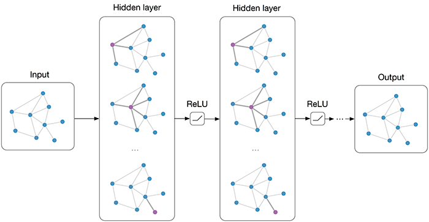

Graph Convolutional Networks in PyTorch
====

PyTorch implementation of Graph Convolutional Networks (GCNs) for semi-supervised classification [1], with Sparse Matrix and Gather/Scatter.

For a high-level introduction to GCNs, see: Thomas Kipf, [Graph Convolutional Networks](http://tkipf.github.io/graph-convolutional-networks/) (2016)



This implementation makes use of the Cora dataset from [2].

## Usage

```python ./pygcn/train.py```

## Requirements

  * PyTorch 1.6.0
  * Python 3.8

## References

[1] [Kipf & Welling, Semi-Supervised Classification with Graph Convolutional Networks, 2016](https://arxiv.org/abs/1609.02907)

[2] [Sen et al., Collective Classification in Network Data, AI Magazine 2008](http://linqs.cs.umd.edu/projects/projects/lbc/)

## Cite

Please cite the paper if you use this code in your own work:

```
@article{kipf2016semi,
  title={Semi-Supervised Classification with Graph Convolutional Networks},
  author={Kipf, Thomas N and Welling, Max},
  journal={arXiv preprint arXiv:1609.02907},
  year={2016}
}
```
